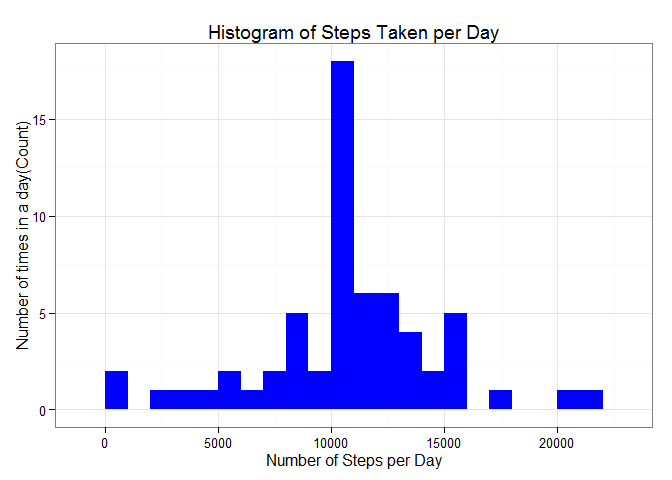

# Reproducible Research: Peer Assessment 1

## Loading and preprocessing the data

Unzip the activity.zip file and load the activity.csv file into the data object.


```r
unzip('activity.zip')
data <- read.csv('activity.csv', header=TRUE, colClasses = c('numeric', 'character', 'numeric'))
```
  
  
## What is mean total number of steps taken per day?

```r
library(reshape2)
date_data <- melt(data[,c('steps', 'date')], id = c('date'))
date_steps <- dcast(date_data, date ~ variable, sum)

library(ggplot2)
```

```
## Warning: package 'ggplot2' was built under R version 3.2.2
```

```r
ggplot(date_steps, aes(x = steps)) + 
       geom_histogram(fill = "purple", binwidth = 1000) + 
        labs(title="Histogram of Steps Taken per Day", 
             x = "Number of Steps per Day", y = "Number of times in a day(Count)") + theme_bw()
```

 

Get the Mean and Median steps taken each day

```r
steps_mean   <- mean(date_steps$steps, na.rm=TRUE)
steps_median <- median(date_steps$steps, na.rm=TRUE)
```

The mean is **10766.189** and median is **10765**.

## What is the average daily activity pattern?
Note:- Missing values ignored at this step.

Make plot of the 5-minute interval (x-axis) and the average number of steps taken (y-axis)


```r
interval_data <- melt(data[, c('steps', 'interval')], id = c('interval')) 
interval_steps <- dcast(interval_data, interval ~ variable, mean, na.rm = TRUE)
qplot(interval, steps, data = interval_steps, geom='line')
```

 

Which 5-minute interval, on average across all the days in the dataset, contains the maximum number of steps?


```r
max_interval <- interval_steps[which.max(interval_steps[, c('steps')]),]$interval
max_steps <- interval_steps[which.max(interval_steps[, c('steps')]),]$steps
```

The **835<sup>th</sup>** interval has maximum **206** steps.


## Imputing missing values

1. Count the missing values in the Dataset


```r
missing_values <- sum(is.na(data$steps))
```
The total number of ***missing values*** are **2304**.

2. Fill up the missing values in the Dataset
Replace missing values with mean (average steps in the interval)


```r
library(plyr)
setMissingSteps <- function(data) {
  if (is.na(data$steps)) {
    data$steps <- interval_steps[interval_steps$interval == data$interval, ]$steps
  }
  data
}
data_without_missing <- adply(data, 1, setMissingSteps)
```

Check for any possible missing values again.

```r
missing_values <- sum(is.na(data_without_missing$steps))
```
The total number of ***missing values*** are **0**.


3. Make new plot of the 5-minute interval (x-axis) and the average number of steps taken (y-axis), without any missing values


```r
data_nomissing_steps <- melt(data_without_missing[,c('steps', 'date')], id = c('date'))
data_nomissing_steps <- dcast(data_nomissing_steps, date ~ variable, sum)

ggplot(data_nomissing_steps, aes(x = steps)) + 
       geom_histogram(fill = "blue", binwidth = 1000) + 
        labs(title="Histogram of Steps Taken per Day", 
             x = "Number of Steps per Day", y = "Number of times in a day(Count)") + theme_bw()
```

 

4. Observation. No Missing values. Get the Mean and Median steps taken each day

```r
steps_mean   <- mean(data_nomissing_steps$steps, na.rm=TRUE)
steps_median <- median(data_nomissing_steps$steps, na.rm=TRUE)
```

The mean is **10766.189** and median is **10766.189**.


## Are there differences in activity patterns between weekdays and weekends?
Yes there are differences.

Plot the activity patterns in time series with weekday data and weekend data.


```r
data_without_missing$dayofweek <- as.POSIXlt(data_without_missing$date)$wday
data_without_missing$dayofweek <- sapply(data_without_missing$dayofweek, 
                                         function(day) {
                                           if (day == 0 || day == 6) {
                                             'weekend'
                                           } else {
                                             'weekday'
                                           }
                                         }
                                        )
data_without_missing$dayofweek <- as.factor(data_without_missing$dayofweek)

meltdata <- melt(data_without_missing[,c('steps', 'interval', 'dayofweek')], 
                 id = c('dayofweek','interval'))
plotdata <- dcast(meltdata, interval + dayofweek ~ variable, mean)

ggplot(plotdata, aes(interval, steps)) + 
  geom_line(color="orange") + 
  facet_grid(dayofweek ~ .) + 
  labs(y = 'Number of steps') + 
  labs(x = 'Interval') +
  theme_bw()
```

 
